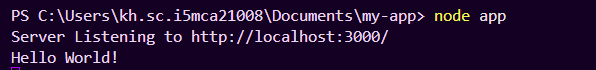
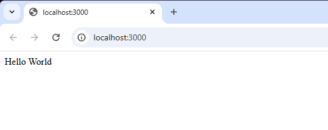
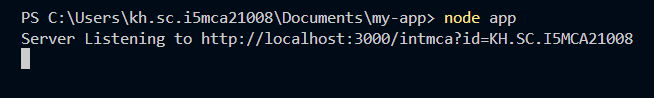
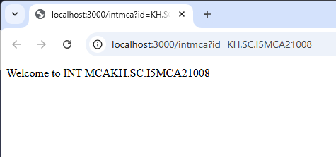
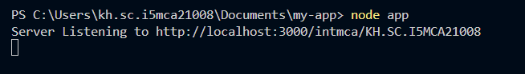
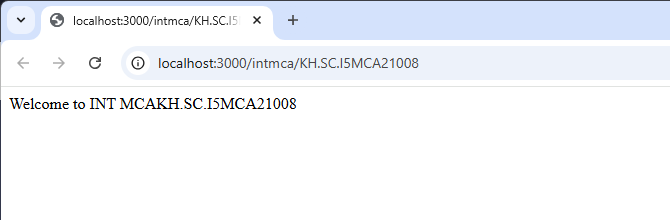

# MEAN-Stack-101

## Pre-Requisites
```bash
node -v
npm -v
```

## Setup
```bash
mkdir folder_name
cd folder_name
npm init -y
npm install express
```


## Node JS Server Creation

### Importing a module in JavaScript for node JS server
```javascript
//Importing HTTP module
const http = require('http')

//Create a Server using createServer method which accepts both request and response from the server
const server = http.createServer(function(req, res){
    res.write("Hello World");
    res.end();
})
server.listen(3000);
// The server listens on port 3000
```
- req is the request object which is comming from the client side
- res is the response object which is going to client as response from the server

- A proper way to write the Server.js code
```javascript
const http = require('http')
const HOST = '127.0.0.1';
const PORT = 3000;
const server = http.createServer((req, res) => {
    res.statusCode = 200;
    res.setHeader('Content-Type', 'text/html');
    res.end('Hello World!');
});
server.listen(PORT, HOST, () => {
    console.log(`Server Listening to http://${HOST}:${PORT}/`);
})
```

## Creating modules and Exporting it

### Modules
- are encapsulated units
- to solve a bigger problem split them into smaller modules

create a file named calc.js and write the below code
```javascript
function add(a,b){ return a+b }
function sub(a,b){ return a-b }

module.exports.add = add;
module.exports.sub = sub;
// module keyword is not mandatory
```
Create another file called operation.js or any different name and give the following code
```javascript
var calc = require("./calc.js");
// to say the module is the same directory

result1 = calc.add(4,5);
result2 = calc.sub(7,5);

console.log(`The Sum is : ${result1}`);
console.log(`The Difference is : ${result2}`);
```

## How to use 'fs' module [File System]

- we can work with any file
- creating a file named fsfile.js in the same folder and give the following code

```javascript
var fs = require('fs');
fs.readFile('calc.js', 'utf8', function(err, data){console.log(data)});
// fs.readFile('filename', 'encoding', callback function)
```
Run fsfile.js in terminal
Output- content of calc.js file

- rewrite the content of fsfile.js as follows
```javascript
var fs = require('fs');
fs.writeFile('calc.js', 'console.log("done")', function(err, data){console.log("Data Saved")});
```
- deletes the file using fsfile.js as follows
```javascript
var fs = require('fs');
fs.unlink('calc.js', function(err, data){console.log("Deleted")});
```
- output - the calc.js file will be deleted from the folder

## Express

- To install Express JS into our project we use NPM (node package manager) with the help of the command inside the terminal inside the path of the project
```bash
npm init -y
```
- The above command is used to initialize a Node JS project and it creates a ***package.json***
```bash
npm install express
```
- The above command install the packages and related libraries of **Express JS** and adds the package into the *package.json*
- Express is used to create custom routing for the Web Applications.

### Example for Express
- create a file app.js
```javascript
const http = require('http')
const express = require('express')
const PORT = 3000;
const app = express();
// Routing
app.get('/', function(req, res){
    // console.log("Hello World!");
    res.send("Hello World");
});
// Server Listening
app.listen(PORT, () => {
    console.log(`Server Listening to http://localhost:${PORT}/`);
});
```



```javascript
const http = require('http')
const express = require('express')
const PORT = 3000;
const app = express();
// Routing
app.get('/', function(req, res){
    // console.log("Hello World!");
    res.send("Hello World");
});

app.get('/intmca', function(req, res){
    const id = req.query.id;
    res.send('Welcome to INT MCA'+id);
})


// Server Listening
app.listen(PORT, () => {
    console.log(`Server Listening to http://localhost:${PORT}/intmca?id=KH.SC.I5MCA21008`);
});
```



```javascript
const http = require('http')
const express = require('express')
const PORT = 3000;
const app = express();
// Routing
app.get('/', function(req, res){
    // console.log("Hello World!");
    res.send("Hello World");
});

app.get('/intmca', function(req, res){
    const id = req.query.id;
    res.send('Welcome to INT MCA '+id);
})

app.get('/intmca/:id', function(req, res){
    const id = req.params.id;
    res.send('Welcome to INT MCA '+id);
})

// Server Listening
app.listen(PORT, () => {
    console.log(`Server Listening to http://localhost:${PORT}/intmca/KH.SC.I5MCA21008`);
});
```



- Up to this There is for Mid Term


## REST API

- It conforms to the REST Architecture
- these APIs use HTTP protocol to access and manipulate data on server
- The essential components of REST API use HTTP Methods
  - GET
  - PUT
  - POST
  - DELETE
- ability to use single language (JS) for both client and server-side development
- fast and powerful even if its single threaded
- Statelessness - each request from a client to a server must contain all the info about the server
- Uniform Interface
- Client Server Architecture

#### Get a List of all books
- endpoint: **/books**
- HTTP method: **GET**
#### Get details of a specific book
- endpoint: **/books/{id}**
- HTTP method: **GET**
#### Add a new book
- endpoint: **/books**
- HTTP method: **POST** (appending to a list)
#### Update a book
- endpoint: **/books/{id}**
- HTTP method: **PUT** (appending to a list)


```javascript
const express = require('express');
const app = express();
const PORT = 3000;

// Middleware to parse JSOn request bodies
app.use(express.json());

// To define the sample data
let books = [
    {
        "id": 1,
        "title": "To Kill a Mockingbird",
        "author": "Harper Lee"
    },
    {
        "id": 2,
        "title": "1984",
        "author": "George Orwell"
    },
    {
        "id": 3,
        "title": "Pride and Prejudice",
        "author": "Jane Austen"
    },
    {
        "id": 4,
        "title": "The Great Gatsby",
        "author": "F. Scott Fitzgerald"
    },
    {
        "id": 5,
        "title": "The Catcher in the Rye",
        "author": "J.D. Salinger"
    }
];

// Define routes for handling the GET requests
app.get('/api/books', function(req, res){
    res.json(books);
});

app.get('/api/books/:id', function(req, res){
    const id = parseInt(req.params.id);
    const book = books.find(book => book.id === id);
    if (book){
        res.json(book);
    }
    else{
        res.status(404).json({
            message: 'Book not found'
        })
    }
});

// POST - Add a new book
app.post('/api/books', (req, res) => {
    const {title, author} = req.body;
    if (!title || !author){
        return res.status(400).json({message: 'Title and author are required'});
    }

    const newBook = {
        id: books.length? books[books.length-1].id + 1 : 1,
        title,
        author
    };

    books.push(newBook);
    res.status(201).json(newBook);
});

// PUT - Update an existing book by id
app.put('/api/books/:id', (req, res)=> {
    const id = parseInt(req.params.id);
    const {title, author} = req.body;
    const bookIndex = books.findIndex(book => book.id === id);

    if (bookIndex === -1){
        return res.status(404).json({message: "Maataan Vendi Nee Indaayitt Vende daaa"})
    }
    
    books[bookIndex] = {
        ...books[bookIndex],
        title: title || books[bookIndex].title,
        author: author || books[bookIndex].author,
    }

    res.json(books[bookIndex]);
})


// Server Listening
app.listen(PORT, () => {
    console.log(`Server Listening to http://localhost:${PORT}/api/books`);
});
```


Warning


### Using POSTMAN VScode Extension

GET Method


POST Method


PUT Method


DELETE Method

