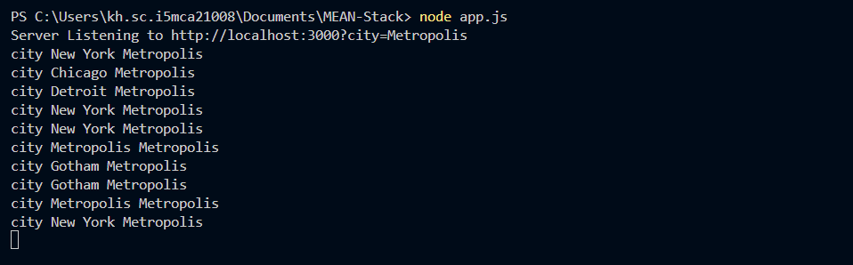

# MEAN-Stack-101

- Basic Program containing everything for Fresh Up JavaScript, HTML and CSS

```html
<!DOCTYPE html>
<html lang="en">
<head>
    <meta charset="UTF-8">
    <meta name="viewport" content="width=device-width, initial-scale=1.0">
    <title>Roll Over Menu Bar</title>

    <style>
        * {
            font-family: Arial, Helvetica, sans-serif;
            margin: 0;
            padding: 0;
            box-sizing: border-box;
        }
        /* Navigation Bar */
        .navbar{
            background-color: #333;
            padding: 10px;
            display: flex;
        }

        .navbar a{
            color: white;
            text-decoration: none;
            padding: 10px 20px;
            display: block;
        }

        .navbar a:hover{
            background-color: #555;
        }

        /*Dropdown container*/
        .dropdown {
            position: relative;
        }

        /*Dropdown menu (Hidden By Default)*/
        .dropdown-menu {
            display: none;
            position: absolute;
            top: 40px;
            left: 0;
            background-color: #444;
            min-width: 150px;
        }

        .dropdown-menu a{
            padding: 10px;
            color: white;
            display: block;
        }

        .dropdown-menu a:hover{
            background-color: #666;
        }


        .container{
            margin-top: 50px;
            display: flex;
            justify-content: space-evenly;
            width: 100%;
            height: 100%;
            gap: 20px;
        }

        .calculator{
            padding: 20px;
            display: flex;
            flex-direction: column;
            gap: 10px;

            input{
                padding: 10px 20px;
                color: black;
                font-size: 16px;
            }

            .buttons {
                display: flex;
                gap: 10px;
                padding: 10px;

                button {
                    padding: 10px 15px;
                    border: none;
                    border-radius: 6px;
                    background-color: rgb(25, 24, 24);
                    color: white;
                    font-weight: bold;
                    font-size: larger;
                }
            }

        }

        .validation_form {
            padding: 20px;
            border-radius: 8px;
            text-align: left;
            width: 300px;
        }

        .validation_form h2{
            text-align: center;
        }

        .validation_form input{
            width: 100%;
            padding: 10px;
            margin: 5px 0;
            border: 1px solid #ccc;
            border-radius: 5px;
        }

        .validation_form input.error-border {
            border: 2px solid red;
        }

        .validation_form .error{
            color: red;
            font-size: 14px;
            display: block;
            margin-bottom: 10px;
        }

        .validation_form button{
            width: 100%;
            padding: 10px;
            background-color: #007bff;
            color: white;
            font-size: 18px;
            border: none;
            cursor: pointer;
            border-radius: 5px;
            margin-top: 10px;
        }

        .validation_form button:hover{
            background-color: #0056b3;
        }
    </style>
</head>
<body>
    <nav class="navbar">
        <a href="#">Home</a>
        <div class="dropdown">
            <a href="#" class="dropdown-toggle">
                Services
            </a>
            <div class="dropdown-menu">
                <a href="#">Web Design</a>
                <a href="#">SEO Analytics</a>
                <a href="#">Digital Marketing</a>
            </div>
        </div>
        <a href="#">About</a>
        <a href="#">Contact</a>
    </nav>


    <main class="container">
        <div class="calculator">
            <h2>Simple Calculator</h2>
            <input type="number" id="num1" placeholder="Enter First Number: ">
            <input type="number" id="num2" placeholder="Enter Second Number: ">


            <div class="buttons">
                <button onclick="calculate('+')">+</button>
                <button onclick="calculate('-')">-</button>
                <button onclick="calculate('/')">/</button>
                <button onclick="calculate('*')">*</button>
            </div>

            <div class="result">
                Result: <span id="result"></span>
            </div>
        </div>


        <div class="validation_form">
            <h2>Form Validation</h2>
            <form id="myForm">
                <label for="name">Name:</label>
                <input type="text" id="name" placeholder="Enter Your Name: ">
                <span class="error" id="nameError"></span>

                <label for="age">Age:</label>
                <input type="number" id="age" placeholder="Enter Your Age: ">
                <span class="error" id="ageError"></span>

                <label for="password">Password:</label>
                <input type="text" id="password" placeholder="Enter Password: ">
                <span class="error" id="passwordError"></span>

                <label for="confirmPassword">Confirm Password:</label>
                <input type="password" id="confirmPassword" placeholder="Re-enter Password: ">
                <span class="error" id="confirmPasswordError"></span>

                <button type="submit">Submit Form</button>
            </form>
        </div>
    </main>


    <script>
        // Select Dropdown Elements from DOM
        const dropdown = document.querySelector('.dropdown');
        const dropdown_menu = document.querySelector('.dropdown-menu');

        // Show Dropdown on hover
        dropdown.addEventListener('mouseenter', () => {
            dropdown_menu.style.display = 'block';
        });

        // Hide Dropdown on mouse leaving
        dropdown.addEventListener('mouseleave', () => {
            dropdown_menu.style.display = 'none';
        });


        //Calculator
        function calculate(operator) {
            let num1 = parseFloat(document.getElementById("num1").value);
            let num2 = parseFloat(document.getElementById("num2").value);
            let resultElement = document.getElementById("result");

            if (isNaN(num1) || isNaN(num2)){
                resultElement.innerText = "Enter Valid Numbers!";
                return;
            }

            let result;
            switch (operator) {
                case '+':
                    result = num1+num2;
                    break;
                case '-':
                    result = num1-num2;
                    break;
                case '*':
                    result = num1*num2;
                    break;
                case '/':
                    result = num2!==0 ? num1 / num2 : "Cannot divide by zero!";
                    break;
                default:
                    result = "Invalid Operation";
            }

            resultElement.innerText = result;
        }


        // Form Validation
        document.getElementById("myForm").addEventListener("submit", function(event) {
            event.preventDefault(); //Prevent Form Submission

            let name = document.getElementById("name");
            let age = document.getElementById("age");
            let password = document.getElementById("password");
            let confirmPassword = document.getElementById("confirmPassword");

            let isValid = true;

            //Helper function to validate and display error
            function validateField(field, errorMsg, condition){
                let errorElement = document.getElementById(field.id + "Error");
                if (condition){
                    errorElement.innerText = errorMsg;
                    field.classList.add("error-border");
                    isValid = false;
                }else{
                    errorElement.innerText = "";
                    field.classList.remove("error-border");
                }
            }

            //Apply Validations
            validateField(name, "Name must contain only letters", !/^[A-Za-z]+$/.test(name.value.trim()));
            validateField(age, "Enter a valid age!", age.value.trim() === "" || isNaN(age.value));
            validateField(password, "Password must be at least 6 characters!", password.value.length < 6);
            validateField(confirmPassword, "Passwords do not match!", password.value !== confirmPassword.value);

            if (isValid){
                alert("Form Submitted Successfully!");
            }
        })
    </script>
</body>
</html>
```

## Pre-Requisites
```bash
node -v
npm -v
```

## Setup
```bash
mkdir folder_name
cd folder_name
npm init -y
npm install express
```

## What is Mean Stack?

- **MEAN Stack** is a collection of JavaScript technologies used for full stack web development.
- It is used for building **dynamic web applications** from frontend to backend using JavaScript.
- MEAN stack is *open-source* and facilitates **rapid development**.

### Components of MEAN Stack
1. **MongoDB** - NoSQL database that stores data in JSON like format.
2. **ExpressJS** - Lightweight and flexible backend framework for Node JS.
3. **AngularJS** - Frontend JavaScript framework developed by Google for creating dynamic web apps.
4. **NodeJS** - Server-side JavaScript runtime environment for handling backend operations.

### MEAN Stack Architecture
- AngularJS handles user requests and UI interactions.
- NodeJS receive and processes client requests.
- ExpressJS routes requests to database and sends response
- MongoDB stores and retreives data for the applicaton.

### Advantages of MEAN Stack
✅Uses **JavaScript** for **both frontend and backend**, ensuring smooth development.
✅**Open-source** and supports rapid application development.
✅**High Performance** with NodeJS event driven architecture.
✅**Scalabe and cloud-friendly**, ideal for modern web apps.

### Disadvantages of MEAN Stack
❌**MongoDB** is not ideal for *large-scale applications* requiring complex transactions.
❌No standard JavaScript coding guidelines.
❌Poor separation of business logic and server logic.
❌Risk of data loss in some cases.

# NodeJS

## Introduction to NodeJS
- NodeJS is an open-source, cross-platform JavaScript runtime environment.
- Runs the V8 JavaScript engine (Google Chrome's core engine) outside the browser.
- Uses asynchronous, event-driven programming for high performance.
- Ideal for scalable, real-time applications due to non-blocking I/O operations.

## Features of NodeJS
✅**Single-threaded & event-driven** : Handles multiple requests using a single thread.
✅**Non-blocking I/O**: Prevents delays by handling multiple tasks asynchronously.
✅**Fast execution** : Uses V8 engine for efficient performance.
✅**Cross Platform Compatibility**
✅**Lightweight**: Does not create separate threads for each request.


## How NodeJS Works?
- Accepts client requests and processes them using a single threaded event loop.
- Uses threads to handle I/O operations like database access or file handling.
- Unlike traditional servers, it does not block execution while waiting for tasks to complete.

## Advantages of NodeJS
✅Highly Scalable
✅Real-time Applications.
✅Faster Development
✅Caching Support
✅Lightweight and Efficient

npm - Node Package Manager (manages dependencies for projects)

## Event Loop in NodeJS
- Handles asynchronous operations using Queue System
- Works in six phases.
    1. Timers - Executes setTimeout/setInterval callbacks.
    2. Pending Callbacks - Handles completed I/O operations.
    3. Idle & Prepare - Internal processing phase.
    4. Poll - Retreives new I/O events.
    5. Check - Processes setImmediate() callbacks.
    6. Close Callbacks - Handles socket closures.


## Node JS Server Creation

### Importing a module in JavaScript for node JS server
```javascript
//Importing HTTP module
const http = require('http')

//Create a Server using createServer method which accepts both request and response from the server
const server = http.createServer(function(req, res){
    res.write("Hello World");
    res.end();
})
server.listen(3000);
// The server listens on port 3000
```
- req is the request object which is comming from the client side
- res is the response object which is going to client as response from the server

- A proper way to write the Server.js code
```javascript
const http = require('http')
const HOST = '127.0.0.1';
const PORT = 3000;
const server = http.createServer((req, res) => {
    res.statusCode = 200;
    res.setHeader('Content-Type', 'text/html');
    res.end('Hello World!');
});
server.listen(PORT, HOST, () => {
    console.log(`Server Listening to http://${HOST}:${PORT}/`);
})
```

## Creating modules and Exporting it

### Modules
- are encapsulated units
- to solve a bigger problem split them into smaller modules

create a file named calc.js and write the below code
```javascript
function add(a,b){ return a+b }
function sub(a,b){ return a-b }

module.exports.add = add;
module.exports.sub = sub;
// module keyword is not mandatory
```
Create another file called operation.js or any different name and give the following code
```javascript
var calc = require("./calc.js");
// to say the module is the same directory

result1 = calc.add(4,5);
result2 = calc.sub(7,5);

console.log(`The Sum is : ${result1}`);
console.log(`The Difference is : ${result2}`);
```

## How to use 'fs' module [File System]

- we can work with any file
- creating a file named fsfile.js in the same folder and give the following code

```javascript
var fs = require('fs');
fs.readFile('calc.js', 'utf8', function(err, data){console.log(data)});
// fs.readFile('filename', 'encoding', callback function)
```
Run fsfile.js in terminal
Output- content of calc.js file

- rewrite the content of fsfile.js as follows
```javascript
var fs = require('fs');
fs.writeFile('calc.js', 'console.log("done")', function(err, data){console.log("Data Saved")});
```
- deletes the file using fsfile.js as follows
```javascript
var fs = require('fs');
fs.unlink('calc.js', function(err, data){console.log("Deleted")});
```
- output - the calc.js file will be deleted from the folder

## Express

- To install Express JS into our project we use NPM (node package manager) with the help of the command inside the terminal inside the path of the project
```bash
npm init -y
```
- The above command is used to initialize a Node JS project and it creates a ***package.json***
```bash
npm install express
```
- The above command install the packages and related libraries of **Express JS** and adds the package into the *package.json*
- Express is used to create custom routing for the Web Applications.

### Example for Express
- create a file app.js
```javascript
const http = require('http')
const express = require('express')
const PORT = 3000;
const app = express();
// Routing
app.get('/', function(req, res){
    // console.log("Hello World!");
    res.send("Hello World");
});
// Server Listening
app.listen(PORT, () => {
    console.log(`Server Listening to http://localhost:${PORT}/`);
});
```


```javascript
const http = require('http')
const express = require('express')
const PORT = 3000;
const app = express();
// Routing
app.get('/', function(req, res){
    // console.log("Hello World!");
    res.send("Hello World");
});

app.get('/intmca', function(req, res){
    const id = req.query.id;
    res.send('Welcome to INT MCA'+id);
})


// Server Listening
app.listen(PORT, () => {
    console.log(`Server Listening to http://localhost:${PORT}/intmca?id=KH.SC.I5MCA21008`);
});
```


```javascript
const http = require('http')
const express = require('express')
const PORT = 3000;
const app = express();
// Routing
app.get('/', function(req, res){
    // console.log("Hello World!");
    res.send("Hello World");
});

app.get('/intmca', function(req, res){
    const id = req.query.id;
    res.send('Welcome to INT MCA '+id);
})

app.get('/intmca/:id', function(req, res){
    const id = req.params.id;
    res.send('Welcome to INT MCA '+id);
})

// Server Listening
app.listen(PORT, () => {
    console.log(`Server Listening to http://localhost:${PORT}/intmca/KH.SC.I5MCA21008`);
});
```


- Up to this There is for Mid Term


## REST API

- It conforms to the REST Architecture
- these APIs use HTTP protocol to access and manipulate data on server
- The essential components of REST API use HTTP Methods
  - GET
  - PUT
  - POST
  - DELETE
- ability to use single language (JS) for both client and server-side development
- fast and powerful even if its single threaded
- Statelessness - each request from a client to a server must contain all the info about the server
- Uniform Interface
- Client Server Architecture

#### Get a List of all books
- endpoint: **/books**
- HTTP method: **GET**
#### Get details of a specific book
- endpoint: **/books/{id}**
- HTTP method: **GET**
#### Add a new book
- endpoint: **/books**
- HTTP method: **POST** (appending to a list)
#### Update a book
- endpoint: **/books/{id}**
- HTTP method: **PUT** (appending to a list)


```javascript
const express = require("express");
const app = express();
const PORT = 3050;

app.use(express.json());

let books = [
  { id: 1, title: "To Kill a Mockingbird", author: "Harper Lee" },
  { id: 2, title: "1984", author: "George Orwell" },
  { id: 3, title: "Pride and Prejudice", author: "Jane Austen" },
  { id: 4, title: "The Great Gatsby", author: "F. Scott Fitzgerald" },
  { id: 5, title: "The Catcher in the Rye", author: "J.D. Salinger" },
];

app.get("/", (req, res) => res.send("Books API"));

// Get all books
app.get("/api/books", (req, res) => res.json(books));

// Get a book by ID
app.get("/api/books/:id", (req, res) => {
  const book = books.find((b) => b.id === parseInt(req.params.id));
  book ? res.json(book) : res.status(404).json({ message: "Book Not Found" });
});

// Add a new book
app.post("/api/books", (req, res) => {
  const { title, author } = req.body;
  if (!title || !author) {
    return res.status(400).json({ message: "Title and author required" });
  }

  const newBook = {
    id: books.length ? books[books.length - 1].id + 1 : 1,
    title,
    author,
  };
  books.push(newBook);
  res.json(newBook);
});

// Update a book
app.put("/api/books/:id", (req, res) => {
  const book = books.find((b) => b.id === parseInt(req.params.id));
  if (!book) return res.status(404).json({ message: "Book Not Found" });

  const { title, author } = req.body;
  if (title) book.title = title;
  if (author) book.author = author;

  res.json(book);
});

// Delete a book
app.delete("/api/books/:id", (req, res) => {
  const index = books.findIndex((b) => b.id === parseInt(req.params.id));
  if (index === -1) return res.status(404).json({ message: "Book Not Found" });

  const deleted = books.splice(index, 1)[0];
  res.json({ message: "Book Deleted", book: deleted });
});

app.listen(PORT, () => {
  console.log(`Server running at http://localhost:${PORT}/`);
});

```


Warning


### Using POSTMAN VScode Extension

GET Method


POST Method


PUT Method


DELETE Method


## NODEMON

- This package restarts the server automatically whenever there is a code change
```bash
npm install -g nodemon
nodemon -v
```

## Applying Filters

### Searching and Filtering in a REST API

- Search and Filtering are very basic features that an API must possss to serve data to the ckuebt
By handling these operations on the server-side, we can reduce the amount of processing that has to be done on the client application, thereby increasing its performance.​

Aim: ​

To build a Node.js REST API that can accept these query strings, filter a list of users based on these provided parameters, and then return the matching results.​

Solution – using Query Strings​

```javascript
// Filename - data.js
const data = [
    { id: 1, name: 'Alan Wake', age: 21, city: 'New York' },
    { id: 2, name: 'Steve Rogers', age: 106, city: 'Chicago' },
    { id: 3, name: 'Tom Hanks', age: 47, city: 'Detroit' },
    { id: 4, name: 'Ryan Burns', age: 16, city: 'New York' },
    { id: 5, name: 'Jack Ryan', age: 31, city: 'New York' },
    { id: 6, name: 'Clark Kent', age: 34, city: 'Metropolis' },
    { id: 7, name: 'Bruce Wayne', age: 21, city: 'Gotham' },
    { id: 8, name: 'Tim Drake', age: 21, city: 'Gotham' },
    { id: 9, name: 'Jimmy Olsen', age: 21, city: 'Metropolis' },
    { id: 10, name: 'Ryan Burns', age: 21, city: 'New York' },
];

module.exports = data;
```

```javascript
// FileName - filter.js
const express = require('express');
const data = require('./data')
const app = express();

app.use('/', (req, res, next) => {
    res.send("Node JS Search and Filter")
});

app.listen(3000, ()=> {
    console.log('Server Started: http://localhost:3000/')
});
```
```javascript
const express = require('express')
const PORT = 3000;
const data = require('./data');
const app = express();
// Routing
app.get('/', function(req, res, next){
    const filters = req.query;
    const filteredUsers = data.filter(user => {
        let isValid = true;
        for (key in filters){
            console.log(key, user[key], filters[key]);
            isValid = isValid && user[key]== filters[key]
        }
        return isValid;
    });
});

// Server Listening
app.listen(PORT, () => {
    console.log(`Server Listening to http://localhost:3000?city=Metropolis​`);
});
```

